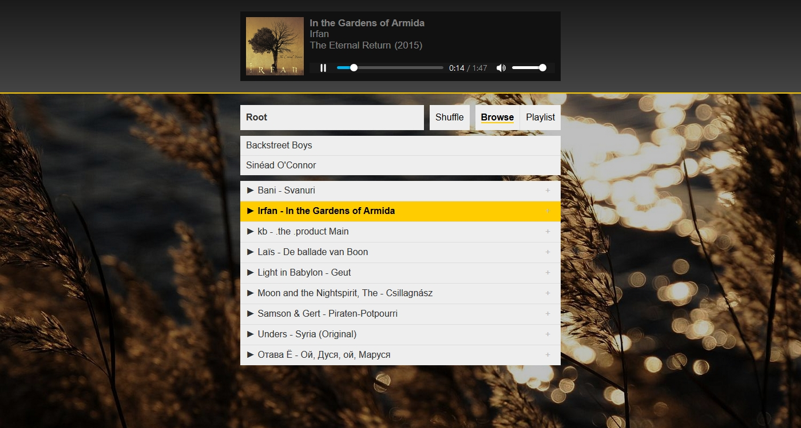
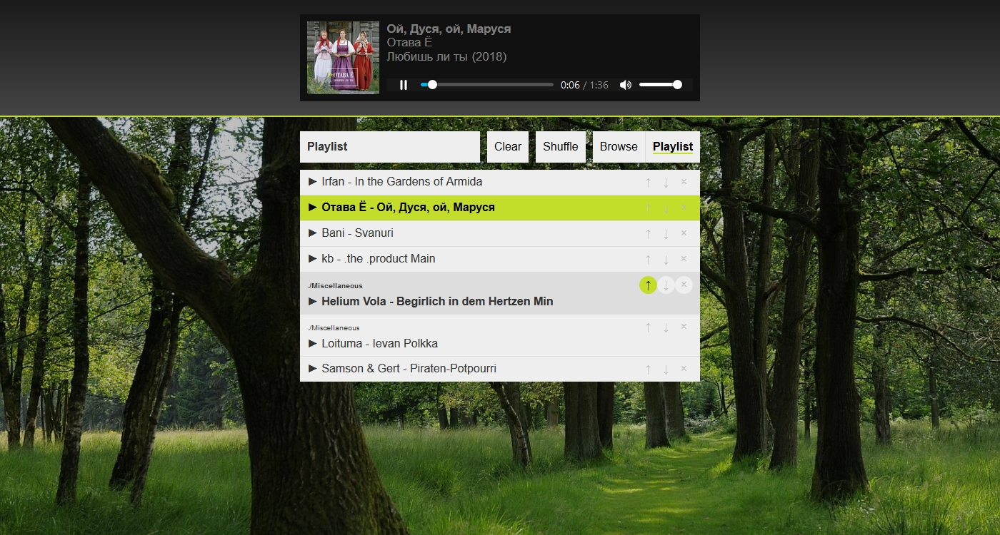
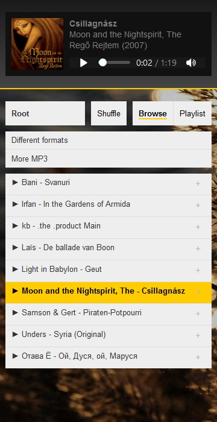
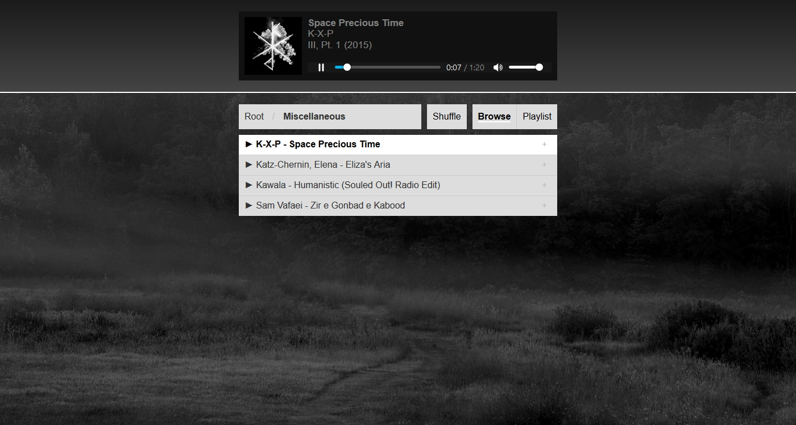

# Noctifer Music

Noctifer Music is a PHP script to turn any self-hosted audio library into an actual music player, allowing files to be easily accessed from a browser. 

Feel free to try the [**live demonstration**](https://music.lrk.tools/demo) using the password 123.

## Features

### Immediately enables folder-based playback

Simply drop `index.php` into any online directory that has audio files (and/or subdirectories containing audio files), and these files can be streamed immediately. The other files are optional, but recommended.

### Supports any format your browser does

Noctifer Music uses the HTML5 `audio` tag to serve the music. Thus, format support is entirely dependent on your browser. 

The [**live demo**](https://music.lrk.tools/demo) has a selection of common file formats available to give them a try.

### Metadata
Relevant metadata is rad using James Heinrich's [getID3](https://github.com/JamesHeinrich/getID3). For most file formats, this includes artist, track title, album title, year, and album art.

### Custom playlist

Folder-based browsing is the default, but a selection of songs can be added to a custom playlist.

### Shuffle

Shuffle mode can be toggled and will apply immediately to your current active song list, be it the current song's directory or your custom playlist.

### Uninterrupted playback while browsing or playlist editing

Browsing and playlist editing is implemented using AJAX calls, leaving the currently playing file unaffected. The page only reloads when a new file is loaded.

### Responsive design

The player adapts to smaller viewports.

### Password protection

Direct links to individual files will always play, but access to directory contents can be password-protected. 

### Different themes

Custom background images and colour schemes can be used. Aside from the above two themes, a third, dark theme is included by default.

## Usage

### Installation

It is recommended to have **PHP 7 or higher** installed. PHP 5 should work, but has known issues with non-ASCII file names.

To install Noctifer Music, simply copy its files to a directory. It only needs to be copied once into the root of your library. The player can navigate subdirectories, but does not allow higher directories to be accessed.

Most importantly, copy `index.php`. Now, when accessing this directory using a browser, the player will show that directory's compatible contents, ready to be played.

Also copy `getID3` if you want metadata to be read. Otherwise, the player will merely show the filename and directory.

The `backgrounds` folder contains background images for the three included themes. Copy these to make everything look slightly more appealing.

### Configuration

`index.php` has a small number of variables at the beginning, allowing the player to be customised.

`$usepassword` allows password protection to be switched on (`true`) or off (`false`). When password protection is used, `$password` contains the plaintext password. This is a simple emasure to block access; do not use a password you use anywhere else for this. 

`$allowedExtensions` is the case-insensitive array of allowed file extensions, determining which files are displayed in the list. By default, it contains `mp3`, `flac`, `wav`, `ogg`, `opus`, and `webm`. Currently, all of these can be played back in Chromium-based browsers and Firefox. Edge and Safari have significantly more limited support. Add or remove extensions from this list as needed.

`$excluded` is a case-sensitive blacklist of items (both files and directories) that should not be displayed in the list.

In desktop mode, `$width` determines the width of the player as a percentage of the full window's width.

The variables `$background`, `$accentfg`, `$accentbg`, `$menubg`, `$menushadow`, `$gradient1`, `$gradient2` and `$filebuttonfg` take hexadecimal colour values to adjust the colour scheme of the player. `$backgroundimg` takes an image path for the background image; `$background` is only visible when no image is indicated. Three theme configurations are included; these can be commented/uncommented as desired. 